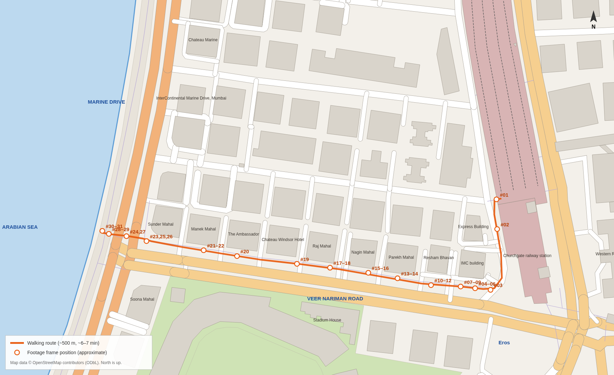

# Churchgate → Marine Drive: route analysis

This is the analysis for milestone 2, written before implementation. It says what the
route is, what you see along it, and what must be built to make the walk from Churchgate
station to the Marine Drive sea wall believable.

Anything marked **⚠ uncertain** is an inference, not something the evidence shows directly.

*Route map, generated by `tools/route-map.mjs` from OpenStreetMap data. Numbered circles
are the approximate positions of the footage frames.*

---

## 1. Sources and how each was used

| Source | What it is | Used for |
|---|---|---|
| **Walking footage** `assets/actual_steps_from_churchgate_to_marine_drive_by_walkings/` | 36 screenshots. #01–#31 come from one walking video (player title *"4k Shoot – Real Mumbai Walking Tours ‖ Urban Street Life"*, 10:33 long); the player timestamps 0:45 → 10:15 are visible. #32–#34 are from a second video (*"marine drive \| khau Galli \| Churchgate station \| Wankhede Stadium"*, overcast day). #35–#36 are file-manager screenshots and are ignored. | Route, order of views, left/right/forward composition, street furniture, crowd density, the moment the view opens. **Nothing is copied into the game.** |
| **OpenStreetMap** `data/osm/south-mumbai.raw.json` `data/osm/back-bay.raw.json` (new) | Building footprints, heights where tagged, roads and carriageways, footways, zebra crossings, traffic signals, bus stops, named businesses, coastline. | Scale, positions, distances and road layout. It is the ground truth for geometry. |
| **Reference photographs** `assets/marine_drive/**` | ~60 photos: promenade, sea wall, tetrapods, Art Deco facades, Soona Mahal, Air India and Trident, the Queen's Necklace at night, monsoon, golden hour. The Alamy/iStock images carry watermarks. | Appearance: materials, proportions, colours and street furniture. Reference only; no pixels are used. |
| **Existing Churchgate build** (milestone 1) | Station, OSM city, traffic, crowd, lighting, audio. | The starting point; reused where it works (see §7). |

Frame numbers below (#NN) are the footage screenshots in time order. Where the video
timestamp is readable it is given as `m:ss`.

---

## 2. Route sequence

Coordinates are in the game's local frame, in metres. The origin is the Churchgate buffer
stops, −z points up the tracks (true bearing 351°) and −x points roughly towards the sea.
Distances are measured along the walking line.

| # | Stage | Where (local x, z) | Walked | Footage | What you see |
|---|---|---|---|---|---|
| 0 | **Concourse → west exit** | (−20, 5.5) → (−27, 5.5) | 0–7 m | #01 | Five steps down under the blue canopy. Above it: **CHURCHGATE** in red letters and the Indian Railways roundel. |
| 1 | **IMC Road**, a side street along the station's west wall, walking south | (−29, 10) → (−32, 84) | 7–85 m | #02 (0:45) | You walk on the road itself between parked cars. The station building is on the left, with a construction hoarding; parked cars and a kaali-peeli taxi on the right, under trees. The IMC building is ahead-right. |
| 2 | **Corner of IMC Road and Veer Nariman Road**. Turn right (west). | (−41, 93) | ~98 m | #03 (1:09) | Green BMC netting ("ROAD & TRAFFIC … inconvenience") around a tree on the corner, and a black heritage lamp post. V.N. Road traffic is on the left. |
| 3 | **V.N. Road north footpath, IMC building stretch** | (−50, 92) → (−115, 76) | 98–170 m | #04–#12 (1:20–2:13) | Wide concrete-paver footpath. White concrete planter boxes line the kerb, with black lantern lamp posts, steel bollards, and a red electrical feeder pillar covered in posters. **Right:** the IMC building (Art Deco eyebrow bands, *W.I.A.A.*, a phone store and *Stadium Restaurant, 76 V.N. Road*), then a white balustrade compound wall and a large banyan with aerial roots. **Kerb side:** the **BEST bus stop** (Ahilyabai Holkar Chowk; purple "बेस्ट" sign on the shelter). **Left:** traffic, the black-and-white striped median, the far footpath. |
| 4 | **Restaurant row** | (−115, 76) → (−190, 50) | 170–250 m | #13–#16 (3:07–3:44) | **Parekh Mahal**: Art Deco with a curved balcony and the name in relief letters, *Mockingbird Café Bar* on the ground floor. Then *Shiv Sagar* (neon) and *Mezcalita* (teal and pink facade, lime saloon doors, pink bench, cactus planters), with a lilac scooter parked in front. Planters, awnings, restaurant staff at the doors. More people here. |
| 5 | **V.N. Road, west half** | (−190, 50) → (−300, 17) | 250–370 m | #17–#20 (4:15–6:26) | Huge old banyans with aerial roots in the footpath, some trunks painted red at the base. A **red India Post pillar box**, a green electrical cabinet, steel bollards, green shade nets over restaurant fronts. Kaali-peeli taxis (Hyundai Santro) and private cars parked along the kerb. A **fan-pattern cobbled apron** at a building gate (#19). **Left, across the road** (#20): the long, low **Brabourne Stadium / CCI** stand with verandahs, and a **lattice floodlight tower** rising above it. **Right** (OSM): Raj Mahal, Union Bank, Chateau Windsor, **The Ambassador**, Manek Mahal. |
| 6 | **Approach: the view opens** | (−300, 17) → (−372, −7) | 370–445 m | #21–#22 (7:06) | Buildings end on both sides (Sunder Mahal on the right, Soona Mahal on the left). The sky opens ahead and the horizon glows with light off the sea. The Marine Drive traffic signals come into view, with its tall twin-arm lamps and the crowd along the sea wall in silhouette. Heritage lamps line the kerb. A compound wall with bougainvillea and a blue-tarp stall on the right, a man walking a dog. |
| 7 | **Marine Drive junction** (V.N. Road meets Marine Drive) | corner (−378, −10) | ~450 m | #23 (7:55), #25, #26 | Signal heads on a black-and-yellow banded post and on overhead mast arms. A **traffic policeman** directs traffic. A red **BEST electric bus** ("ZERO EMISSION") turns into V.N. Road. Yellow water-filled barricades, a small police booth. **Left (south):** **Soona Mahal**, the yellow Art Deco corner building with curved balconies, red vertical fins and a round tower under a flying-saucer cap; *HDFC Bank* and *Pizza by the Bay* at street level. Beyond it the **Nariman Point skyline**: Air-India Building (~555 m), Trident (~720 m), Express Towers. **Right (north):** the Art Deco row curving away, a sign gantry, and the Malabar Hill skyline across Back Bay. |
| 8 | **Crossing Marine Drive** at the northern zebra | (−380, −11) → (−410, −20) | 450–485 m | #24, #27 (8:06) | Thick white **zebra stripes** and a **white criss-cross box-junction grid**. Cars and taxis wait at the stop line; some taxis have roof carriers. You cross the east carriageway, a median refuge, then the west carriageway. The low sun is straight ahead and people at the sea wall are silhouetted against it. |
| 9 | **Promenade** | (−410, −20) → (−419, −23) | 485–495 m | #28, #29 (9:59) | Dark grey pavers with a white band. The low sea wall is lined with people sitting on it. A Mumbai Traffic Police "RIDE SAFELY / WEAR HELMET" board and a tripod photographer. **Left:** the promenade crowd running south towards the Air India and Trident towers. |
| 10 | **Sea wall, facing the Arabian Sea** | (−419, −23) | ~495 m | #30, #31 (10:15), #32–#34 | Families sit on the flat top of the parapet (~0.7 m high). Below are tetrapods, then the calm, glittering water of Back Bay, with the Malabar Hill towers low across the bay. At sunset the sun sits over the water to the west. |

**Arrival point:** the sea wall at about **(−420, −23)**, just north-west of the junction, facing
west-north-west over Back Bay. From there, looking left you see the Nariman Point skyline and
looking right the curve of the Queen's Necklace.

### Distances and timing

| Segment | Length |
|---|---|
| Concourse → west exit | ~7 m |
| IMC Road to the V.N. Road corner | ~91 m |
| V.N. Road north footpath to the Marine Drive corner | ~355 m |
| Crossing Marine Drive (east footpath → promenade) | ~31 m |
| Promenade to the wall | ~10 m |
| **Total** | **~495 m, about 6½ min at 1.3 m/s** |

The footage covers 0:45 → 7:55 from IMC Road to the junction, 7.2 min including stops at
shopfronts. That agrees with the OSM distances.

V.N. Road runs at a true bearing of about **278°** from Churchgate to Marine Drive. On
20 April the sun sets at about **282°**, so you walk straight into the sunset. This is
why the build's golden hour is set on that date.

---

## 3. Where the environment visually changes

1. **Station → street** (west exit): from the dim, enclosed shed to open daylight.
   Exposure adapts and sound goes from a reverberant hall to open traffic.
2. **IMC Road → V.N. Road** (corner): from a narrow service street to a broad boulevard
   under a canopy of old trees, with dappled light and denser foot traffic.
3. **Restaurant row**: shopfronts, neon, awnings and signage get denser, and so does the crowd.
4. **Past The Ambassador / Sunder Mahal**: the tree canopy and building line end and the sky
   opens ahead. The horizon brightens with light off the sea, and the tall Marine Drive
   lamps and signals appear. **This is the key transition.**
5. **At the junction**: the full width of Marine Drive. The Nariman Point skyline appears on
   the left, the curve on the right, and traffic noise peaks.
6. **Across the road**: the sea fills the view. Wind and waves take over the soundscape and
   the crowd sits along the wall.

---

## 4. Streetscape inventory

### Roads, markings and signals

- **V.N. Road** is a dual carriageway. Its two one-way centre lines are ~13.5 m apart,
  with 3 lanes each way and a ~3.5 m median with **black-and-white** striped kerbs.
  - The building line is ~20 m from the north carriageway centre. That leaves room for a
    parking lane (~3 m), the footpath (~6 m) and front compounds (~4–7 m).
  - Traffic keeps left: the north carriageway runs east (towards Churchgate) and the
    south carriageway runs west (towards the sea).
- **Marine Drive at the junction**: two one-way carriageways either side of a median line
  (OSM). The east carriageway runs south and the west carriageway (sea side) runs north.
  - OSM tags 3 lanes each way, but the carriageway centre lines are 8–10 m from the median.
    The photos show about 4 lanes each way, so the build uses **4 lanes (~14 m) each way
    and a ~2.5 m median**. **⚠ uncertain**
- **Crossings:** OSM has two zebra crossings over Marine Drive, north (z ≈ −17) and south
  (z ≈ +17) of V.N. Road, and signals at (−417, 11), (−389, −12) and (−397, 13). The route
  uses the **north** crossing, which is inferred from the north-footpath route and the
  camera direction in #24/#27. **⚠ uncertain**
- **Markings:** white zebra bars, a **white criss-cross box junction** (#24/#25) and dashed
  lane lines.
- **Signals:**
  - Signal heads on grey posts with overhead mast arms, some on black-and-yellow banded
    posts (#23). The references show black-and-white striped posts at other Marine Drive
    junctions.
  - Pedestrian signal heads.
  - Mumbai signals often have countdown timers. **⚠ uncertain** for this junction.
- **Police:** a traffic policeman at the junction (#23) and a small police booth with a
  pitched roof (#23, far left).

### Footpaths, promenade and sea wall

- **V.N. Road footpath:**
  - Grey concrete pavers in running bond with a raised kerb.
  - White cube planters along the kerb (#04–#05).
  - Tree pits and fan-pattern cobbles at gates (#19).
- **Marine Drive promenade:**
  - About **10 m wide** from the kerb to the wall. The OSM coastline marks the seaward
    toe of the tetrapods, ~10 m beyond the wall.
  - Dark grey rectangular pavers with a white band (#28).
  - A continuous row of **steel U-hoop barriers** along the kerb.
  - Tall twin-arm street lights along the kerb and on the median.
  - Trees (Indian almond) along the kerb towards Nariman Point.
- **Sea wall:**
  - A continuous concrete parapet about **0.7–0.9 m high** with a broad flat top, light
    grey and weathered.
  - Some stretches have a lower sitting step on the promenade side.
  - People sit on the top facing the sea (#28, #30).
- **Tetrapods:**
  - A band of dark grey four-legged concrete armour units, ~1.5–2 m each, piled from the
    waterline to just below the wall top.
  - Wet and darker near the water, with white wash around them.

### Buildings

- **Along V.N. Road** (OSM names, north side):
  - IMC building, Resham Bhavan, Parekh Mahal, Nagin Mahal, Raj Mahal, Chateau Windsor,
    The Ambassador, Manek Mahal, Sunder Mahal (7 floors, on the corner).
  - Style: 1930s–40s **Art Deco**, 4–7 floors, cream or pastel. Horizontal eyebrow
    sunshades, curved corner balconies, the building name in relief letters, and steel
    window grilles with AC units on brackets.
- **South side:**
  - Stadium House, the **Brabourne Stadium (CCI)** compound (OSM polygon along the road),
    then Soona Mahal on the corner.
- **Soona Mahal** (south-east corner of the junction; see `05_Buildings/2,4,12,13.jpeg`):
  - Yellow and cream, with curved balconies and two red vertical fins.
  - A round corner tower topped by a flying-saucer cap.
  - Glazed ground floor.
- **The Ambassador** (north side, ~100 m before the junction): `right_view.jpeg` shows a
  round rooftop drum shaped like a revolving restaurant behind the corner building.
  **⚠ uncertain** that this is The Ambassador; modelled as a modest rooftop drum.
- **Marine Drive row** (east side, both directions):
  - A continuous row of Art Deco apartment blocks, 5–7 floors, cream, white and pastel,
    with rounded corners, curved balconies and ribbon windows.
  - The Wankhede Stadium floodlight towers rise behind them to the north (`1.jpeg`,
    `3.jpeg`).
- **Nariman Point skyline** (south):

  | Building | Distance from the junction | Floors / height |
  |---|---|---|
  | Air-India Building | ~555 m | 23 floors, ~116 m |
  | Trident | ~720 m | 35 floors, ~117 m |
  | Express Towers | ~590 m | 25 floors |
  | The Oberoi | ~830 m | ~20 floors |
  | NCPA apartments | ~1.1 km | 23 floors (OSM) |
  | Nirmal | — | 21 floors (OSM) |

  - Air-India Building: a white slab with a dense window grid, a roof crown and the logo
    on top.
  - Trident: a slab with vertical ribs.
  - Heights come from public knowledge where OSM has no tag. **⚠ approximate**
- **Across Back Bay** (north-west, 2–4.5 km):
  - Malabar Hill, Walkeshwar, Girgaon Chowpatty, Kemps Corner and Tardeo, including the
    twin **Imperial Towers** (60 floors, OSM).
  - Only **20–30 % of these buildings have heights in OSM**; the rest are estimated.
    **⚠ approximate**

### Trees and vegetation

- **V.N. Road:**
  - Very large old banyan (*Ficus benghalensis*) and peepal trees with aerial roots
    standing in the footpath.
  - Rain trees, bougainvillea (magenta) over compound walls, potted plants at restaurant
    fronts.
- **Marine Drive:** coconut palms in front of the Art Deco row, small trees and shrubs on
  the median, and Indian almond trees on the promenade towards Nariman Point.
- **April:** gulmohar in bloom.

### Street furniture and details

- **V.N. Road footpath:**
  - Black lantern-style heritage lamp posts along the kerb.
  - Steel bollards (single, and in rows at driveways).
  - Red and green feeder pillars covered in posters and stickers.
  - A red India Post pillar box on a concrete base.
  - The BEST bus shelter with its purple sign.
  - Compound walls: white balustrades, black wrought-iron railings, gates.
  - Green shade nets over restaurant fronts, AC outdoor units on building facades.
  - Construction netting and hoardings (temporary, but very typical).
- **Marine Drive:**
  - Twin-arm lamps.
  - Police sign boards ("RIDE SAFELY", "WEAR HELMET"), a sign gantry, dustbins.
  - Vendors: roasted-corn and peanut sellers **⚠ typical of Marine Drive, not seen
    clearly in the footage**.

### Vehicles and people

- **Vehicles:**
  - Kaali-peeli taxis (Hyundai Santro / Maruti Wagon R; some with roof carriers) and
    white app-cabs.
  - SUVs (Innova, Scorpio, Kia).
  - Red **BEST** buses: an electric single-decker and the double-decker.
  - Scooters and motorbikes, police vehicles.
- **People:**
  - V.N. Road: a steady stream of office-goers, students and tourists, groups of 2–4 people,
    restaurant staff standing at doors.
  - Marine Drive: at sunset it is **crowded**. An almost continuous line of people sits on
    the wall; families, couples and walkers fill the promenade.

---

## 5. Left / right / forward at key points

| Point | Forward | Left | Right |
|---|---|---|---|
| West exit | IMC Road southwards, parked cars, trees | Station building wall | Express Building / IMC building |
| V.N. Road corner | The tree-lined boulevard west; bright sky at the far end | Traffic, median, south footpath, Hotel Astoria / Eros behind | IMC building, planters, lamps |
| Restaurant row | Footpath with banyans and people; sunset glow down the road | Parked cars, traffic, Brabourne Stadium's stand and floodlights | Shopfronts: Parekh Mahal, restaurants, neon |
| Approach (~−320) | The junction and signals, the sea horizon, the sun | Soona Mahal's round tower | Sunder Mahal corner, compound wall, stall |
| Junction corner | The zebra over Marine Drive, the promenade crowd, the sea | Soona Mahal; Air India and Trident beyond | Marine Drive curving north, the Art Deco row, Malabar Hill |
| Sea wall | The Arabian Sea, the sun on the water | Promenade and Nariman Point skyline | The Queen's Necklace curve and the Malabar Hill towers |

---

## 6. Deliberate improvements over the footage

- **Business names:** the shops in the footage (the phone store, Stadium Restaurant,
  Mockingbird, Mezcalita, Shiv Sagar) are trademarks and they change over time. The game
  uses **fictional businesses in the same visual idiom**: an Irani café sign, a teal-and-pink
  cantina, a neon snack bar, a mobile store. **Building names** (Parekh Mahal, Soona Mahal,
  Sunder Mahal) are kept because they are part of Mumbai's Art Deco identity.
- **Crowds:** the footage is very crowded, which blocks views. The game uses a believable,
  somewhat thinner crowd along V.N. Road and a dense one at the sea wall.
- **Time of day:** the footage is late afternoon with harsh light. The game uses its
  golden-hour preset, which matches the direction of the light but is warmer and lower.
  Morning, afternoon and night presets still work.
- **Temporary objects:** the BMC netting, one construction hoarding and scaffolding are kept
  as flavour, but not every one.
- **Overcast frames #32–#34** are used only for the wall, tetrapods and crowd, not for lighting.

---

## 7. Assets already available (reused)

| From milestone 1 | Reuse |
|---|---|
| OSM city generator: footprints → facades, roofs, rooftop tanks, collision | All buildings outside the hand-modelled corridor |
| Facade texture array (Art Deco, grille, stone, shop, glass, station) | Base for the new Art Deco styles |
| Procedural surfaces: asphalt, pavers, concrete, kerb stripes, decals | Road, footpath and litter decals |
| Street trees (4 variants including flowering gulmohar) | General trees; new banyan and palm variants added |
| Traffic system (left-hand, OSM lanes, taxis, BEST buses) | Extended with signal stop lines |
| Crowd system (instanced skinned people, LOD, avoidance) | Extended with street walkers and sea-wall sitters |
| Sky, sun position, fog, volumetric shafts, time-of-day presets | Unchanged, with the haze retuned for distant skyline visibility |
| Signage and ad atlas, Devanagari fonts | Street signage and shopfronts |
| Eros Cinema, WR HQ dome, the station and its west exit | Unchanged |
| Cinematic player, walking-camera paths, explore controls | Extended route film; explore walks the whole way |
| Procedural audio | Extended with sea, wind and junction sounds |

## 8. Assets to create or improve

| Asset | Priority | Notes |
|---|---|---|
| Wider OSM extract: Back Bay coastline and far buildings | **P0** | Skyline and correct land/sea shape |
| Walkable ground (heightfield) for footpaths, crossing and promenade | **P0** | The whole route must be walkable |
| V.N. Road streetscape: parking lanes, 6 m footpaths, black-and-white median, planters, heritage lamps, bollards, feeder pillars, post box, bus shelter, compound walls, shopfront dressing | **P0** | The street's identity |
| Marine Drive corridor: 4+4 lanes, median, zebras, box junction, stop lines, signals with pedestrian heads, police booth and barricades | **P0** | The crossing experience |
| Promenade, sea wall and tetrapod band (near detail plus a cheap far band along the whole curve) | **P0** | The arrival |
| Arabian Sea: waves, fresnel sky reflection, sun glitter, foam at the tetrapods | **P0** | The payoff view |
| Nariman Point landmarks (Air India, Trident, Express Towers) and the Back Bay skyline | **P1** | Recognition |
| Art Deco generator: rounded corners, curved balconies, fins, name lettering; Soona Mahal landmark | **P1** | Recognition |
| Queen's Necklace night lights along the whole curve | **P1** | Night view |
| Street pedestrians, sea-wall sitters, vendors | **P1** | Life |
| Signal phases that stop traffic for pedestrians | **P1** | Crossing believability |
| Banyan with aerial roots, coconut palm | **P1** | Vegetation identity |
| Stadium floodlight masts (Brabourne, Wankhede) | **P2** | Seen in #20 and the references |
| Sea, wind and junction audio | **P2** | Atmosphere |
| Extended cinematic: station → V.N. Road → junction → crossing → sea wall | **P0** | The continuous journey |

---

## 9. Uncertainties and assumptions

- **Which exit:** frame #01 shows the red CHURCHGATE sign on the station building. The
  model has this sign on the concourse's west exit; the real sign may be a few metres
  further south on the building's west face. **⚠**
- **The IMC Road walk** is inferred from #02/#03 and OSM (the IMC building sits on the corner
  of IMC Road and V.N. Road). The footage does not show the turn itself. **⚠**
- **Which zebra crossing:** the north one, inferred. **⚠**
- **Marine Drive lane count and widths** are fitted to OSM centre lines and the photos. **⚠**
- **Wall, promenade and tetrapod dimensions** are estimated from photos, as no survey data
  is available. **⚠**
- **Heights:**
  - Soona Mahal, Sunder Mahal and the Marine Drive row: OSM levels where present,
    otherwise 6–7 floors. **⚠**
  - Air India and Trident: public figures, not OSM. **⚠**
  - Distant skyline: 70–80 % estimated. **⚠**
- **The Ambassador's rooftop drum**, and the number and placement of the stadium
  floodlight masts, are approximate. **⚠**
- **Countdown timers** on the signals are a Mumbai convention, not seen at this junction. **⚠**
- **Sea level:** mid-tide, ~3 m below the promenade. The real tidal range is ~4–5 m.
- **Vendors** are typical of Marine Drive but not visible in these frames. **⚠**

---

## 10. Implementation status (first version)

Built. The route is continuous in both the film and explore mode; nothing teleports.

| Stage | What is in the build |
|---|---|
| **West exit → IMC Road** | Parked cars and taxis along the station wall. Walkers flow out of the station towards V.N. Road. |
| **Corner (IMC Road / V.N. Road)** | Heritage lamp, BMC road-works netting around the corner tree, rounded kerb. |
| **V.N. Road** | Dual carriageway: 3 lanes each way with lane markings and a black-and-white median. Parking lanes with kaali-peeli taxis. 6 m paver footpaths and compound walls (white balustrade by the IMC building, black railings, bougainvillea). Street furniture: white planters, heritage lanterns, steel bollards, red and green feeder pillars with posters, India Post pillar box, and the BEST bus shelter with its purple "बेस्ट · अहिल्याबाई होळकर चौक" sign. Banyans with aerial roots, rain trees, gulmohar. Shopfronts with fictional bilingual signs and awnings. Building-name plates. The Brabourne Stadium wall, with floodlight masts on the south side. |
| **Art Deco corridor** | Every corridor building gets a pastel palette, projecting floor bands, rounded corner stacks with curved balconies, accent fins and stepped parapets. **Soona Mahal** has yellow walls, red fins and the round corner tower with a saucer cap. |
| **Junction** | Box junction, zebra crossings, stop lines. Signals on poles and mast arms, with pedestrian heads and countdown timers. A signal cycle that traffic obeys. Yellow barricades, police booth, sign gantry. |
| **Marine Drive** | 4+4 lanes, median with lamps. Twin-arm street lights along the whole curve. Promenade pavers with the white band, U-hoop barriers, dustbins, police boards, corn vendors. Sea-wall step and parapet. About 3,700 modelled tetrapods near the junction, plus a rubble band beyond. |
| **Sea** | Gerstner swell, scrolling ripples, foam where it meets the tetrapods, silty shallow tint. Reflections of the sun by day; golden streaks from the Queen's Necklace at night. |
| **Skyline** | Air-India Building (roof crown and logo), Trident, Express Towers, Oberoi. Malabar Hill, Walkeshwar and Girgaon from OSM, including the twin Imperial Towers. Lit windows and aviation lights at night. |
| **People** | Walkers on both V.N. Road footpaths and the promenade. People wait at the zebra for the green man and cross with you. A bus-stop queue. The sunset crowd sits along the wall (about 400) or stands at it. |
| **Sound** | Positional sea wash, wave splashes and wind; traffic and horns; crowd murmur. |
| **Film** | 19 shots, about 5 minutes: train → platform → concourse → IMC Road → V.N. Road → junction → crossing → sea wall → crane shot. |
| **Explore** | Walk the whole route. Start from the concourse, from Marine Drive, or from wherever the film ends. The sea wall stops you. A location label updates as you go. |

**Adjusted during implementation:**
- Both zebras moved off the OSM nodes onto straight kerbs: north 6 m, south 10 m.
- A local Marine Drive lane count of 4+4.

## 11. Changes after the first walk-through (feedback round 1)

| Feedback | What changed |
|---|---|
| Police chowki missing at Churchgate | A police chowki (cabin, glazed upper half, blue hipped roof, beacon, "POLICE / पोलीस चौकी" boards) on the pavement outside the west exit, right of the steps as you come out, with a policeman on duty. The Marine Drive booth uses the same model, and a traffic policeman stands at the junction corner. **⚠ The exact spot comes from the walk-through description, not from footage or map data.** |
| Crowd at the west exit never leaves | The concourse, the exit steps and the pavement were separate walkable areas with a 30 cm gap between them, so everyone crossing got stuck. They now join, and the steps have a height ramp. People leaving by the west exit carry on as street walkers (down IMC Road, to the sea or up Marine Drive). Street walkers heading for a train walk up the steps and on to a platform. New walkers never appear within 70 m in view, and people finishing a route in view keep walking. People at the sea wall stroll away when they are done. |
| Everyone wears the same clothes | Two new body types: a young man (T-shirt or casual shirt, jeans, sneakers, fuller hair, sling bag or cap) and a young woman (fitted top with jeans, a skirt or a dress; open hair or a ponytail; handbag). Wider palettes for shirts, denim, tops and skirts. Shoe colours vary (white sneakers, brown, tan sandals). Some men wear jeans. About 45 % of the street crowd and 30 % of the station crowd are young. |
| Couples | About 16 % of promenade and V.N. Road walkers are couples. They walk side by side, keep pace, wait at the signal together, and leave together. About 30 % of occupied sea-wall seats near the junction hold a couple sitting close together. |
| Shop names overlapping | Every line on a board is measured and fitted. Long names stack English over Marathi instead of sitting side by side. The same fitting now applies to the BEST sign, the BMC netting and the police boards. |
| Trees | Branching trunks and limbs. Foliage clusters at the twig tips face outwards. The crowns are shaded darker inside and underneath. There are new rain-tree, gulmohar-in-bloom and glossy banyan leaf textures, and a bark texture. Banyans drop roots to the ground only near the trunk; elsewhere the roots are trimmed above head and roof height. |
| Pedestrians and cars cross together | Pedestrians step off the kerb only while at least 21 s of green and flashing green remain. They walk briskly across. The pedestrian phase is now 22 s green, 8 s flashing and 3 s all-red. Walkers no longer start the session in the middle of the zebra. In the film, the junction clock is set once, as the walk leaves the station, instead of jumping at the kerb. A measured run over two full cycles showed no car and pedestrian on the same half of a zebra at the same time. |
| Night too dark | Tall twin-arm lights down the V.N. Road median. Street lights along IMC Road, from north of the west exit to V.N. Road. Single-arm lights on the junction corners. Stronger light pools from every lamp. Shop boards are back-lit after dark, and the far lamps glow as sprites. **⚠ The V.N. Road median lights and their 30 m spacing are an assumption; the footage is daytime only.** |
| Cars driving through walls | The OSM lane lines are resampled every 2 m and eased onto the modelled lanes. Previously the V.N. Road eastbound lanes past IMC Road ran along the raised median. Every lane and every turn between lanes is now tested against buildings, walls, posts and kerbed islands, and those that pass through are left out (24 in all, mostly compound driveways). City avenue trees and lamp posts no longer land on the other carriageway of dual roads. Untagged one-way streets carry two lanes, which keeps M.K. Road clear of the station wall. The car bodies were inside out, so their sides were invisible; this is fixed. |
| Traffic lights look off / out of sync | Traffic stopped correctly at every stop line (measured: no red-light running). What you saw from the pavement were the backs and sides of heads facing the drivers. Every corner pole now also carries a head for the opposite carriageway. Lit lamps throw a glow that can be seen from the side, and it carries further at night. |
